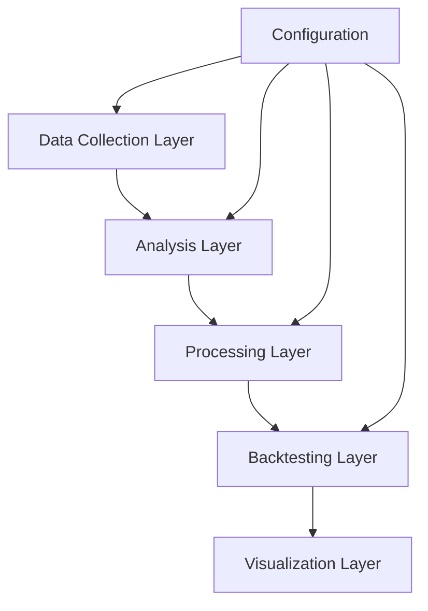
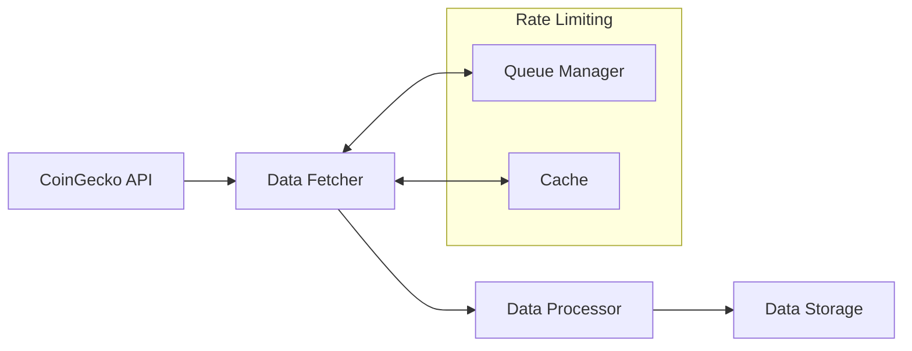
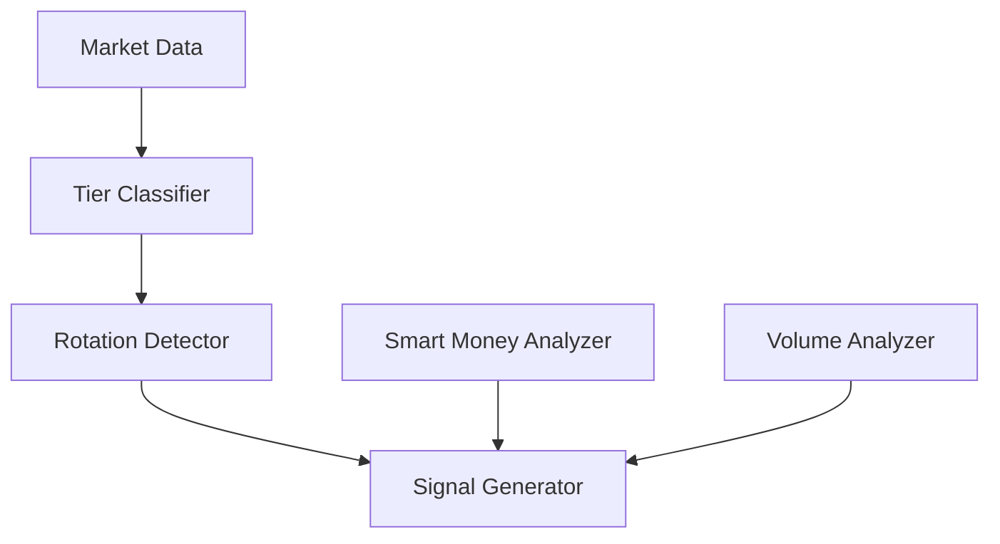
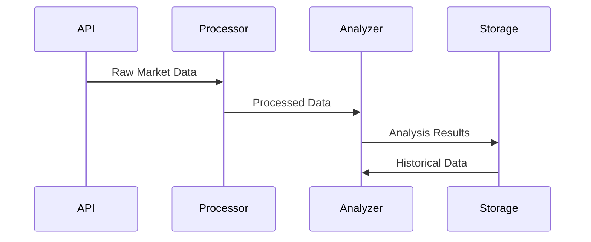
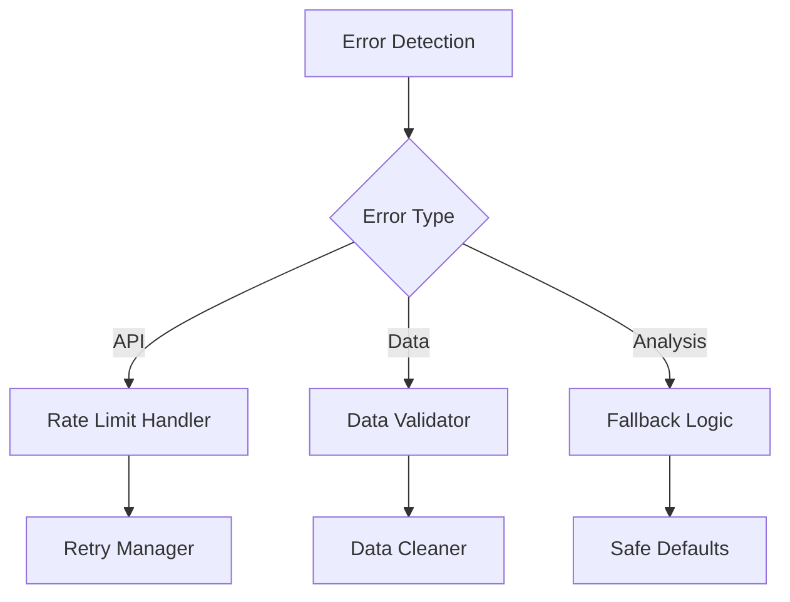
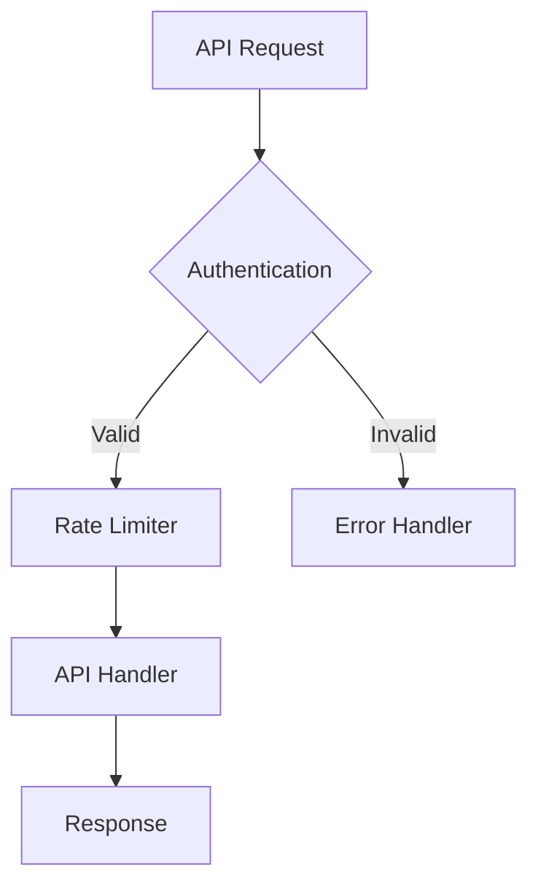
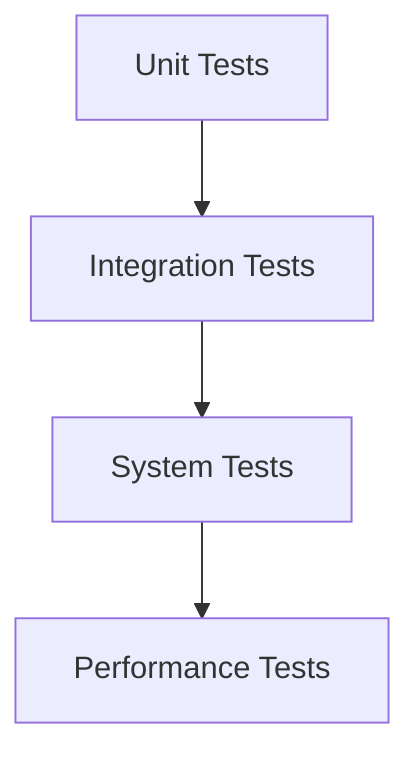
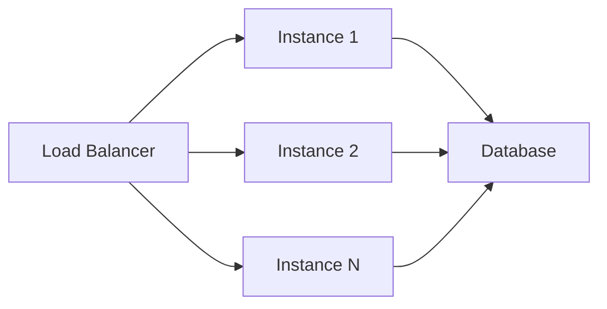
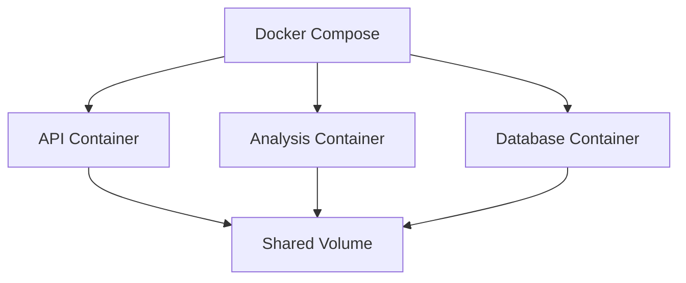

# Crypto Tier Analysis - Architecture Documentation

## System Overview

### High-Level Architecture


## Core Components

### 1. Data Collection Layer


#### Key Components:
- **API Client**: Handles CoinGecko interactions
- **Rate Limiter**: Manages API request quotas
- **Data Validator**: Ensures data quality
- **Cache Manager**: Optimizes API usage

### 2. Analysis Layer


#### Core Analysis Components:
1. **Tier Classifier**
   - Market cap analysis
   - Volume profile assessment
   - Tier boundary calculation

2. **Rotation Detector**
   - Inter-tier flow analysis
   - Correlation tracking
   - Pattern recognition

3. **Smart Money Analyzer**
   - Institutional movement detection
   - Volume analysis
   - Accumulation patterns

## Data Flow Architecture

### 1. Data Pipeline


### 2. Processing Pipeline
```python
class DataPipeline:
    def __init__(self):
        self.collectors = [
            MarketDataCollector(),
            VolumeDataCollector(),
            MetricsCollector()
        ]
        self.processors = [
            DataCleaner(),
            FeatureExtractor(),
            SignalGenerator()
        ]
        
    async def execute(self):
        # Pipeline implementation
```

## Component Details

### 1. Configuration System
```yaml
# Configuration Structure
system:
  update_frequency: 3600
  max_tiers: 4
  lookback_periods: 30

analysis:
  volume_threshold: 2.0
  correlation_threshold: 0.7
  min_confidence: 0.6

backtesting:
  initial_capital: 100000
  position_size: 0.1
  risk_factor: 0.02
```

### 2. Error Handling


## Performance Optimization

### 1. Memory Management
```python
class MemoryOptimizer:
    def __init__(self):
        self.cache = LRUCache(maxsize=1000)
        self.data_retention = timedelta(days=90)
        
    def optimize(self, data: pd.DataFrame) -> pd.DataFrame:
        # Memory optimization logic
```

### 2. Computational Optimization
- Vectorized operations
- Parallel processing
- Efficient data structures

## Security Architecture

### 1. API Security


### 2. Data Security
- Encryption at rest
- Secure configuration
- Access control

## Testing Architecture

### 1. Test Layers


### 2. Test Implementation
```python
class TestFramework:
    def __init__(self):
        self.test_suites = {
            'unit': UnitTests(),
            'integration': IntegrationTests(),
            'system': SystemTests()
        }
```

## Scalability Considerations

### 1. Horizontal Scaling


### 2. Vertical Scaling
- Memory optimization
- CPU utilization
- I/O optimization

## Monitoring and Logging

### 1. Metrics Collection
```yaml
metrics:
  - system_health:
      - cpu_usage
      - memory_usage
      - api_latency
  
  - business_metrics:
      - signal_accuracy
      - prediction_performance
      - strategy_returns
```

### 2. Logging Structure
```python
class LogManager:
    def __init__(self):
        self.loggers = {
            'system': SystemLogger(),
            'analysis': AnalysisLogger(),
            'performance': PerformanceLogger()
        }
```

## Deployment Architecture

### 1. Container Structure


### 2. Configuration Management
- Environment variables
- Configuration files
- Secrets management

## Future Considerations

### 1. Planned Improvements
- Machine learning integration
- Real-time processing
- Advanced analytics

### 2. Scalability Roadmap
- Database sharding
- Microservices architecture
- Cloud deployment

## Best Practices

### 1. Code Organization
- Clean architecture principles
- SOLID principles
- Design patterns

### 2. Development Workflow
- Version control
- Code review
- Continuous integration

## System Requirements

### 1. Hardware Requirements
- CPU: 4+ cores
- RAM: 16GB+
- Storage: 100GB+

### 2. Software Requirements
- Python 3.8+
- PostgreSQL 12+
- Docker
