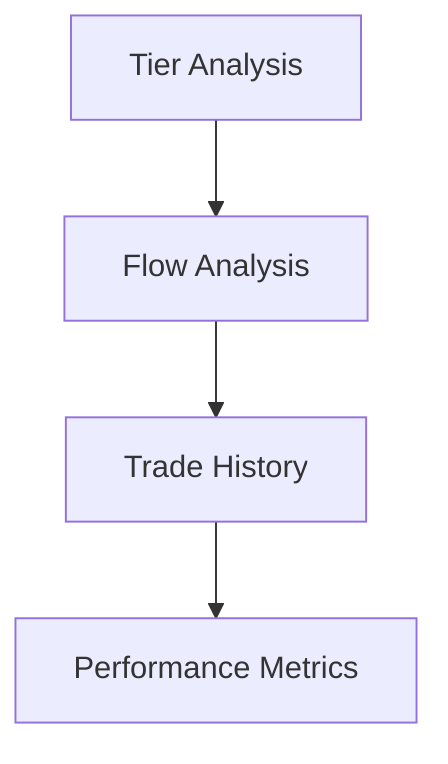

# Visualization Guide for Crypto Tier Analysis

## Table of Contents
1. [Tableau Setup](#tableau-setup)
2. [Data Preparation](#data-preparation)
3. [Dashboard Creation](#dashboard-creation)
4. [Advanced Visualizations](#advanced-visualizations)
5. [Interpretation Guide](#interpretation-guide)

## Tableau Setup

### Initial Setup
1. Install Tableau Public (free) or Tableau Desktop
2. Connect to exported CSV files from the system
3. Set up data relationships between files

### Data Source Configuration
```python
# Export data for Tableau
from src.visualization.tableau_export import TableauExporter

exporter = TableauExporter()
exported_files = exporter.export_for_tableau(
    market_data=market_data,
    signals=signals,
    backtest_results=results
)
```

## Data Preparation

### 1. Required Files
- tier_analysis_{timestamp}.csv
- flow_analysis_{timestamp}.csv
- trade_history_{timestamp}.csv
- performance_metrics_{timestamp}.csv

### 2. Data Relationships


## Dashboard Creation

### 1. Tier Distribution Dashboard

#### Required Charts
1. **Market Cap Distribution**
```
Columns: Tier Name
Rows: SUM(Market Cap)
Color: Tier
Chart Type: Treemap
```

2. **Volume Profile**
```
X-Axis: Market Cap (log scale)
Y-Axis: Volume
Color: Tier
Size: Volume/Market Cap Ratio
Chart Type: Scatter Plot
```

3. **Tier Performance**
```
Columns: Tier Name
Rows: AVG(Return)
Color: Measure Values
Chart Type: Bar Chart
```

### 2. Capital Flow Dashboard

#### Required Charts
1. **Flow Heatmap**
```
Rows: From Tier
Columns: To Tier
Color: Flow Strength
Chart Type: Heatmap
```

2. **Signal Timeline**
```
X-Axis: Timestamp
Y-Axis: Confidence
Color: Signal Type
Shape: From Tier
Chart Type: Scatter Plot with Lines
```

3. **Sankey Diagram**
```
Source: From Tier
Target: To Tier
Size: Flow Volume
Color: Confidence
Chart Type: Sankey Diagram (requires extension)
```

### 3. Smart Money Dashboard

#### Required Charts
1. **Accumulation/Distribution**
```
X-Axis: Timestamp
Y-Axis: Smart Money Flow
Color: Signal Type
Chart Type: Line Chart with Points
```

2. **Volume Analysis**
```
X-Axis: Timestamp
Y-Axis: Large Transaction Ratio
Color: Tier
Chart Type: Area Chart
```

### 4. Performance Dashboard

#### Required Charts
1. **PnL Distribution**
```
X-Axis: PnL Range
Y-Axis: COUNT(Trades)
Color: Trade Status
Chart Type: Histogram
```

2. **Performance Metrics**
```
Metrics: Win Rate, Sharpe Ratio, Max Drawdown
Chart Type: KPI Cards
```

## Advanced Visualizations

### 1. Interactive Filters
- Date Range Selector
- Tier Selection
- Confidence Threshold
- Volume Threshold

### 2. Custom Calculations

#### Tier Rotation Strength
```
IF [Flow Strength] > [Previous Flow Strength] THEN
    ([Flow Strength] - [Previous Flow Strength]) / [Previous Flow Strength]
ELSE
    0
END
```

#### Smart Money Confidence
```
([Large Transaction Ratio] * 0.4) +
([Volume Profile Score] * 0.3) +
([Price Action Score] * 0.3)
```

### 3. Dynamic Parameters
Create these as dashboard parameters:
- Flow Strength Threshold
- Confidence Level Filter
- Time Window Selection

## Interpretation Guide

### 1. Tier Distribution Analysis
- Look for concentration changes
- Monitor tier boundaries
- Track volume distribution

### 2. Flow Pattern Recognition
**Strong Rotation Signal:**
- High confidence (> 0.7)
- Increasing volume
- Clear direction

**Weak Rotation Signal:**
- Low confidence (< 0.5)
- Inconsistent volume
- Mixed direction

### 3. Performance Analysis
**Key Metrics to Monitor:**
1. Win Rate by Tier
2. Average Return per Trade
3. Risk-Adjusted Returns
4. Drawdown Periods

## Best Practices

### 1. Dashboard Organization
- Use consistent color schemes
- Add clear titles and legends
- Include tooltip explanations
- Maintain clean layout

### 2. Performance Optimization
- Use extracts instead of live connections
- Create calculated fields sparingly
- Index key columns
- Use parameter actions

### 3. Regular Maintenance
- Update data sources daily
- Validate calculations
- Check for anomalies
- Monitor dashboard performance

## Troubleshooting

### 1. Data Connection Issues
- Verify file paths
- Check data types
- Validate relationships
- Review extract refresh logs

### 2. Performance Issues
- Simplify complex calculations
- Use aggregation
- Limit number of marks
- Optimize filters

### 3. Visualization Problems
- Check null values
- Verify axis scales
- Review color schemes
- Validate date formats

## Dashboard Updates

### Daily Updates
1. Refresh data extracts
2. Validate metrics
3. Check for anomalies
4. Update annotations

### Weekly Updates
1. Review performance metrics
2. Adjust thresholds if needed
3. Update trend analysis
4. Generate reports

## Custom Extensions

### 1. Required Extensions
- Sankey Diagram
- Advanced Analytics
- Custom Color Palettes
- Parameter Actions

### 2. Installation Steps
1. Download extensions
2. Add to Tableau
3. Configure settings
4. Test functionality

## Next Steps

1. Start with basic dashboards
2. Add complexity gradually
3. Gather user feedback
4. Iterate and improve
5. Document changes

Remember to regularly validate your visualizations against the underlying data and maintain consistent updating schedules for optimal analysis.
